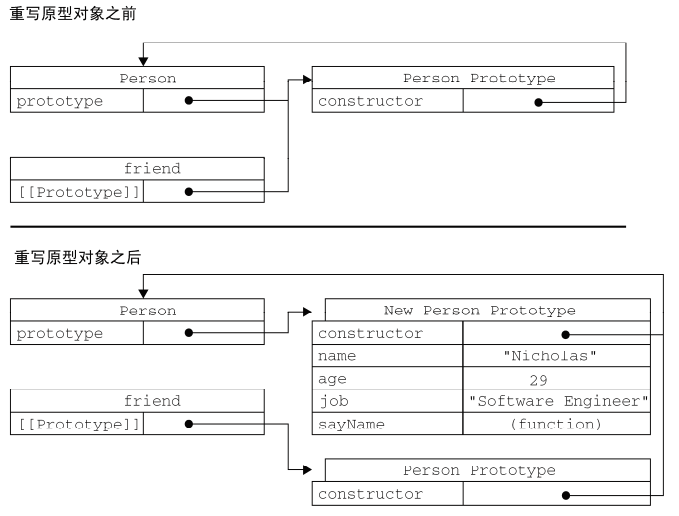
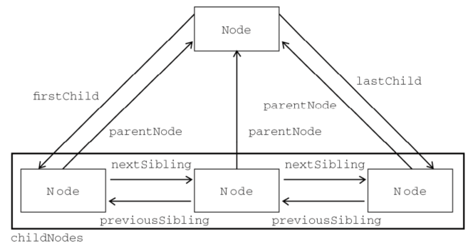

> 仅仅记录自己觉得重要的小细节点

## 1. defer和async属性

defer：脚本执行时不会影响页面的构造，脚本将延迟在遇到`</html>`后再执行，并且先于`DOMContentLoaded`事件执行

async：标记的脚本并不保证按照指定的先后顺序执行，并且不让页面等待脚本下载和执行，从而异步加载页面的其他内容，会在`load`事件前执行，可能会在`DOMContentLoaded`前或后执行

## 2. 严格模式

`use strict`开启严格模式，可以在函数内部声明，指明函数在严格模式下执行

## 3. `typeof`

未声明的变量同样返回`undefined`

```javascript
// 未声明
// var age

typeof age // undefined
```

## 4. `for in`

可以用来枚举对象的属性

- 循环顺序不确定
- 建议使用之前先确定对象是否为null或者undefined（es5前会报错）

## 5. `with`

将当前作用域设置到一个特定的对象之中

```javascript
with(location) {
  var qs = search.substring(1)
  var hostName = hostname
  var url = href
}
```

## 6. 没有重载

没有像java一样的重载方法来对同样的方法名写出不同的处理

如果同一个函数名的函数被定义多次，只取最后一个定义的函数

## 7. 垃圾回收机制

- 标记清除：对所有变量进行标记，再对局部变量和函数内引用的变量去除标记，最后将有标记的变量作为准备清除的变量
- 引用计数：跟踪被引用的次数，引用次数为0时在下一次垃圾回收时清除，存在`循环引用`的弊端，导致计数不能为0，无法被清除

- 管理内存：在对象不被使用时手动赋值为`null`

> 随着 IE7 的发布，其 JavaScript 引擎的垃圾收集例程改变了工作方式：触发垃圾收集的变量分配、
字面量和（或）数组元素的临界值被调整为动态修正。 IE7 中的各项临界值在初始时与 IE6 相等。如果
垃圾收集例程回收的内存分配量低于 15%，则变量、字面量和（或）数组元素的临界值就会加倍。如果
例程回收了 85%的内存分配量，则将各种临界值重置回默认值。这一看似简单的调整，极大地提升了 IE
在运行包含大量 JavaScript 的页面时的性能。

## 8. 数组

- 最多包含4, 294, 967, 295项

## 9. 数组ES5方法

- every()
- filter()
- forEach()
- map()
- some()
- reduce()
- reduceRight()
- indexOf()
- lastIndexOf()
- push()
- pop()
- shift()
- unshift()
- splice()
- slice()
- concat()
- reverse()
- sort()

## 10. `Date`

- Date.now()
- Date.UTC()
- Date.parse()

## 11. Function

- 函数声明创建的函数会进行提升，在任何地方都可以使用
- 函数表达式创建的函数只有在解析到所在代码行后才可以正常使用
- arguments拥有属性callee指向拥有arguments的函数

## 12. 基本包装类型

- 引用类型与基本包装类型的主要区别就是对象的生存期。使用 new 操作符创建的引用类型的实例，
在执行流离开当前作用域之前都一直保存在内存中。而自动创建的基本包装类型的对象，则只存在于一
行代码的执行瞬间，然后立即被销毁。这意味着我们不能在运行时为基本类型值添加属性和方法。

## 13. 转型函数

- 使用`new`调用的基本包装类型的构造函数，和直接调用的转型函数不一样
```javascript
typeof new Number(1) // 'object'
typeof Number(1) // 'number'
```

## 14. `Object.defineProperty()`

- IE8是第一个实现`Object.defineProperty()`的浏览器版本，但限制较多，只能在DOM对象上使用（Vue只兼容到IE9原因？）实现不够彻底
- `Object.defineProperty()`
- `Object.defineProperties()`
- `Object.getOwnPropertyDescriptor`读取属性的描述符
```javascript
const obj = { a: 1 }
const descriptor = Object.getOwnPropertyDescriptor(obj, 'a')
```
## 15. 构造函数
### new 的作用
1）创建一个新对象

2）将构造函数的作用域赋给新对象（this）

3）执行构造函数中的代码

4）返回这个新对象

## 16. 原型模式

- 创建了自定义的构造函数之后，其原型对象默认只会取得`constructor`属性，其他方法都是从`Object`继承而来的
- 创建的新实例内部包含一个指针指向原型对象，叫做`[[Prototype]]`，在`Firefox`，`Safari`，`Chrome`中实现了`__proto__`属性能够访问到原型对象
- 对于实例和原型对象的关系，可以使用`isPrototypeOf()`来检测
```javascript
function Person () {
  this.name = 'John'
}
const person = new Person()
Person.prototype.isPrototypeOf(person) // true
Object.prototype.isPrototypeOf(person) // true

// es5 新增 Object.getPrototypeOf() 返回 [[Prototype]] 的值
// 兼容性IE9+
Object.getPrototypeOf(person) == Person.prototype // true
Object.getPrototypeOf(person).name // John
```
- 遍历所有可以/不可以枚举的实例属性，使用`Object.getOwnPropertyNames()`
- **实例中的指针仅指向原型，而不指向构造函数**,也就是说实例访问原型是直接访问原型的指针，而不是通过访问构造函数的`prototype`属性间接访问的
```javascript
function Person () {}
const person = new Person()
Person.prototype = {
  constructor: Person,
  sayName: function() {
    console.log('name')
  }
}
person.sayName() // Error
```


## 17. 原型链继承
### 17.1 组合继承（伪经典继承）

- 借用构造函数来实现对实例属性的继承，以及利用原型链来继承原型对象的属性

```javascript
function Parent (name) {
  this.name = name
  this.color = ['red', 'blue', 'green']
}
Parent.prototype.sayName = function () {
  console.log(this.name)
}
function Child (name, age) {
  Parent.call(this, name)
  this.age = age
}
Child.prototype = new Parent()
Child.prototype.constructor = Child
Child.prototype.sayAge = function () {
  console.log(this.age)
}

var instance1 = new Child('a', 21)
instance1.color.push('black')
console.log(instance1.color) // red,blue,green,black
instance1.sayName() // a
instance1.sayAge() // 21

var instance2 = new Child('b', 22)
console.log(instance2.color) // red,blue,green
instance2.sayName() // b
instance2.sayAge() // 22
```
### 17.2 原型式继承
```javascript
function object(o) {
  function F() {}
  F.prototype = o
  return new F()
}
```
- 借助原型可以基于已有的对象创建新的对象
- 必须有一个对象可以作为另一个对象的基础
- es5通过新增`Object.create()`方法规范化了原型式继承
```javascript
// 兼容性IE9+
var person = {
  name: 'a'
}
var anotherPerson = Object.create(person, {
  name: {
    value: "Greg"
  }
})
```
### 17.3 寄生式继承
- 思路类似于寄生构造函数和工厂模式，封装一个函数实现
- 类似于构造函数模式，不能够做到函数复用，每次传入都需要生成新的函数
```javascript
function createAnother(o) {
  var clone = object(o)
  clone.sayHi = function() {
    console.log('hi')
  }
  return clone
}
```
### 17.4 寄生组合式继承
- 解决了组合式继承方法，Child的原型对象上会多出Parent的实例属性，而Child的实例又拥有相同的属性覆盖了原型对象上属性的问题
- 通过借用构造函数来继承属性，通过原型链的混成形式来继承方法

```javascript
function Parent(name) {
  this.name = name
  this.color = ['red', 'blue', 'green']
}
Praent.prototype.sayName = function() {
  console.log(this.name)
}
function Child(name, age) {
  Parent.call(this, name)
  this.age = age
}
Child.prototype = Object.create(Parent.prototype, {
  constructor: {
    value: Child,
    writable: true,
    enumerable: false,
    configurable: true
  }
})

const child = new Child()
child.sayName()
```

## 18. 创建对象（类）
三种模式
- 工厂模式：使用最基本的方法创建，然后返回这个对象
- 构造函数模式：使用了`this`关键字去定义属性和方法，缺点是不能复用，比如函数
- 原型模式：使用`prototype`来定义共享的属性或者方法

## 19. 函数递归
- 存在的问题：如果说函数内递归调用时，函数名称的变量值发生了改变，就会导致出错，对外界的依赖度太大
- `arguments.callee`是指向正在执行函数的指针，严格模式下会报错
```javascript
function factorial(num) {
  if (num <= 1) {
    return 1
  } else {
    return num * factorial(num - 1)
  }
}
// 尝试下面的情况
var anotherFactorial = factorial
factorial = null
anotherFactorial(4) // 出错
// 解决办法，使用arguments.callee
function factorial(num) {
  num <= 1 ? return 1 : return num * arguments.callee(num - 1)
}
// 严格模式下解决办法
var factorial = (function f() {
  num <= 1 ? return 1 : return num * f(num - 1)
})
```

## 20. BOM
- 获取屏幕宽高标准的顺序
```javascript
const screenW = window.innerWidth || document.documentElement.clientWidth || document.body.clientWidth
const screenH = window.innerHeight || document.documentElement.clientHeight || document.body.clientHeight
```
- `document.location` 和 `window.location` 引用的是同一个对象
- BOM的核心对象是`window`，在浏览器中，是ECMAScript规定的`Global`对象
- 全局定义的变量会自动成为window对象的属性，但是全局变量和window上定义的属性进行删除时有一点不同
```javascript
var age = 20
window.color = 'red'

// IE9以下都报错
delete window.age // return false
delete window.color // return true
```

## 21. DOM

### 操作api：
- `appendChild`
- `insertBefore`
- `replaceChild`
- `removeChild`
- `cloneNode`(不会复制添加到DOM节点中的js事件/属性)
- `normalize`

### 常见节点
- document.documentElement
- document.body
```html
<body>
  <ul>
    <li>123</li>
  </ul>
</body>
```
- 如上结构打印`document.body.childNodes`长度为3，第1和第3个都是`Text`的`Node`，为换行符，只有中间第2个是`ul`标签

### 常见属性
- `document.title`
- `document.URL`
- `document.referer`
- `document.domain`

### 获取Node
- `document.getElementById`
- `document.getElementsByTagName`
- `document.getElementsByClassName`
- `document.getElementsByName`
- 返回的是`HTMLCollection`，有`namedItem()`方法，可以筛选`name`属性

### 设置属性
- `getAttribute`
- `setAttribute`
- `removeAttribute`

### 理解DOM
- DOM操作是js中开销最大的部分，因为NodeList都是动态的，所以每次访问都会进行一次查询，为了提升性能，尽量减少DOM的操作