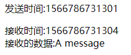

> 查缺补漏

## 1. defer和async属性

defer：脚本执行时不会影响页面的构造，脚本将延迟在遇到`</html>`后再执行，并且先于`DOMContentLoaded`事件执行

async：标记的脚本并不保证按照指定的先后顺序执行，并且不让页面等待脚本下载和执行，从而异步加载页面的其他内容，会在`load`事件前执行，可能会在`DOMContentLoaded`前或后执行

## 2. 严格模式

`use strict`开启严格模式，可以在函数内部声明，指明函数在严格模式下执行

## 3. `typeof`

未声明的变量同样返回`undefined`

```javascript
// 未声明
// var age

typeof age // undefined
```

## 4. `for in`

可以用来枚举对象的属性

- 循环顺序不确定
- 建议使用之前先确定对象是否为null或者undefined（es5前会报错）

## 5. `with`

将当前作用域设置到一个特定的对象之中

```javascript
with(location) {
  var qs = search.substring(1)
  var hostName = hostname
  var url = href
}
```

## 6. 没有重载

没有像java一样的重载方法来对同样的方法名写出不同的处理

如果同一个函数名的函数被定义多次，只取最后一个定义的函数

## 7. 垃圾回收机制

- 标记清除：对所有变量进行标记，再对局部变量和函数内引用的变量去除标记，最后将有标记的变量作为准备清除的变量
- 引用计数：跟踪被引用的次数，引用次数为0时在下一次垃圾回收时清除，存在`循环引用`的弊端，导致计数不能为0，无法被清除

- 管理内存：在对象不被使用时手动赋值为`null`

> 随着 IE7 的发布，其 JavaScript 引擎的垃圾收集例程改变了工作方式：触发垃圾收集的变量分配、
字面量和（或）数组元素的临界值被调整为动态修正。 IE7 中的各项临界值在初始时与 IE6 相等。如果
垃圾收集例程回收的内存分配量低于 15%，则变量、字面量和（或）数组元素的临界值就会加倍。如果
例程回收了 85%的内存分配量，则将各种临界值重置回默认值。这一看似简单的调整，极大地提升了 IE
在运行包含大量 JavaScript 的页面时的性能。

## 8. 数组

- 最多包含4, 294, 967, 295项

## 9. 数组ES5方法

- every()
- filter()
- forEach()
- map()
- some()
- reduce()
- reduceRight()
- indexOf()
- lastIndexOf()
- push()
- pop()
- shift()
- unshift()
- splice()
- slice()
- concat()
- reverse()
- sort()

## 10. `Date`

- Date.now()
- Date.UTC()
- Date.parse()

## 11. Function

- 函数声明创建的函数会进行提升，在任何地方都可以使用
- 函数表达式创建的函数只有在解析到所在代码行后才可以正常使用
- arguments拥有属性callee指向拥有arguments的函数

## 12. 基本包装类型

- 引用类型与基本包装类型的主要区别就是对象的生存期。使用 new 操作符创建的引用类型的实例，
在执行流离开当前作用域之前都一直保存在内存中。而自动创建的基本包装类型的对象，则只存在于一
行代码的执行瞬间，然后立即被销毁。这意味着我们不能在运行时为基本类型值添加属性和方法。

## 13. 转型函数

- 使用`new`调用的基本包装类型的构造函数，和直接调用的转型函数不一样
```javascript
typeof new Number(1) // 'object'
typeof Number(1) // 'number'
```

## 14. `Object.defineProperty()`

- IE8是第一个实现`Object.defineProperty()`的浏览器版本，但限制较多，只能在DOM对象上使用（Vue只兼容到IE9原因？）实现不够彻底
- `Object.defineProperty()`
- `Object.defineProperties()`
- `Object.getOwnPropertyDescriptor`读取属性的描述符
```javascript
const obj = { a: 1 }
const descriptor = Object.getOwnPropertyDescriptor(obj, 'a')
```
## 15. 构造函数
### new 的作用
1）创建一个新对象

2）将构造函数的作用域赋给新对象（this）

3）执行构造函数中的代码

4）返回这个新对象

## 16. 原型模式

- 创建了自定义的构造函数之后，其原型对象默认只会取得`constructor`属性，其他方法都是从`Object`继承而来的
- 创建的新实例内部包含一个指针指向原型对象，叫做`[[Prototype]]`，在`Firefox`，`Safari`，`Chrome`中实现了`__proto__`属性能够访问到原型对象
- 对于实例和原型对象的关系，可以使用`isPrototypeOf()`来检测
```javascript
function Person () {
  this.name = 'John'
}
const person = new Person()
Person.prototype.isPrototypeOf(person) // true
Object.prototype.isPrototypeOf(person) // true

// es5 新增 Object.getPrototypeOf() 返回 [[Prototype]] 的值
// 兼容性IE9+
Object.getPrototypeOf(person) == Person.prototype // true
Object.getPrototypeOf(person).name // John
```
- 遍历所有可以/不可以枚举的实例属性，使用`Object.getOwnPropertyNames()`
- **实例中的指针仅指向原型，而不指向构造函数**,也就是说实例访问原型是直接访问原型的指针，而不是通过访问构造函数的`prototype`属性间接访问的
```javascript
function Person () {}
const person = new Person()
Person.prototype = {
  constructor: Person,
  sayName: function() {
    console.log('name')
  }
}
person.sayName() // Error
```


## 17. 原型链继承
### 17.1 组合继承（伪经典继承）

- 借用构造函数来实现对实例属性的继承，以及利用原型链来继承原型对象的属性

```javascript
function Parent (name) {
  this.name = name
  this.color = ['red', 'blue', 'green']
}
Parent.prototype.sayName = function () {
  console.log(this.name)
}
function Child (name, age) {
  Parent.call(this, name)
  this.age = age
}
Child.prototype = new Parent()
Child.prototype.constructor = Child
Child.prototype.sayAge = function () {
  console.log(this.age)
}

var instance1 = new Child('a', 21)
instance1.color.push('black')
console.log(instance1.color) // red,blue,green,black
instance1.sayName() // a
instance1.sayAge() // 21

var instance2 = new Child('b', 22)
console.log(instance2.color) // red,blue,green
instance2.sayName() // b
instance2.sayAge() // 22
```
### 17.2 原型式继承
```javascript
function object(o) {
  function F() {}
  F.prototype = o
  return new F()
}
```
- 借助原型可以基于已有的对象创建新的对象
- 必须有一个对象可以作为另一个对象的基础
- es5通过新增`Object.create()`方法规范化了原型式继承
```javascript
// 兼容性IE9+
var person = {
  name: 'a'
}
var anotherPerson = Object.create(person, {
  name: {
    value: "Greg"
  }
})
```
### 17.3 寄生式继承
- 思路类似于寄生构造函数和工厂模式，封装一个函数实现
- 类似于构造函数模式，不能够做到函数复用，每次传入都需要生成新的函数
```javascript
function createAnother(o) {
  var clone = object(o)
  clone.sayHi = function() {
    console.log('hi')
  }
  return clone
}
```
### 17.4 寄生组合式继承
- 解决了组合式继承方法，Child的原型对象上会多出Parent的实例属性，而Child的实例又拥有相同的属性覆盖了原型对象上属性的问题
- 通过借用构造函数来继承属性，通过原型链的混成形式来继承方法

```javascript
function Parent(name) {
  this.name = name
  this.color = ['red', 'blue', 'green']
}
Praent.prototype.sayName = function() {
  console.log(this.name)
}
function Child(name, age) {
  Parent.call(this, name)
  this.age = age
}
Child.prototype = Object.create(Parent.prototype, {
  constructor: {
    value: Child,
    writable: true,
    enumerable: false,
    configurable: true
  }
})

const child = new Child()
child.sayName()
```

## 18. 创建对象（类）
三种模式
- 工厂模式：使用最基本的方法创建，然后返回这个对象
- 构造函数模式：使用了`this`关键字去定义属性和方法，缺点是不能复用，比如函数
- 原型模式：使用`prototype`来定义共享的属性或者方法

## 19. 函数递归
- 存在的问题：如果说函数内递归调用时，函数名称的变量值发生了改变，就会导致出错，对外界的依赖度太大
- `arguments.callee`是指向正在执行函数的指针，严格模式下会报错
```javascript
function factorial(num) {
  if (num <= 1) {
    return 1
  } else {
    return num * factorial(num - 1)
  }
}
// 尝试下面的情况
var anotherFactorial = factorial
factorial = null
anotherFactorial(4) // 出错
// 解决办法，使用arguments.callee
function factorial(num) {
  num <= 1 ? return 1 : return num * arguments.callee(num - 1)
}
// 严格模式下解决办法
var factorial = (function f() {
  num <= 1 ? return 1 : return num * f(num - 1)
})
```

## 20. BOM
- 获取屏幕宽高标准的顺序
```javascript
const screenW = window.innerWidth || document.documentElement.clientWidth || document.body.clientWidth
const screenH = window.innerHeight || document.documentElement.clientHeight || document.body.clientHeight
```
- `document.location` 和 `window.location` 引用的是同一个对象
- BOM的核心对象是`window`，在浏览器中，是ECMAScript规定的`Global`对象
- 全局定义的变量会自动成为window对象的属性，但是全局变量和window上定义的属性进行删除时有一点不同
```javascript
var age = 20
window.color = 'red'

// IE9以下都报错
delete window.age // return false
delete window.color // return true
```

## 21. DOM 1级（定义HTML和XML的底层结构）

### 操作api：
- `appendChild`
- `insertBefore`
- `replaceChild`
- `removeChild`
- `cloneNode`(不会复制添加到DOM节点中的js事件/属性)
- `normalize`

### 常见节点
- document.documentElement
- document.body
```html
<body>
  <ul>
    <li>123</li>
  </ul>
</body>
```
- 如上结构打印`document.body.childNodes`长度为3，第1和第3个都是`Text`的`Node`，为换行符，只有中间第2个是`ul`标签

### 常见属性
- `document.title`
- `document.URL`
- `document.referer`
- `document.domain`

### 获取Node
- `document.getElementById`
- `document.getElementsByTagName`
- `document.getElementsByClassName`
- `document.getElementsByName`
- `children`属性，`HTMLCollection`实例
- 返回的是`HTMLCollection`，有`namedItem()`方法，可以筛选`name`属性

### 设置属性
- `getAttribute`
- `setAttribute`
- `removeAttribute`

### 理解DOM
- DOM操作是js中开销最大的部分，因为NodeList都是动态的，所以每次访问都会进行一次查询，为了提升性能，尽量减少DOM的操作

## 22. `DOM`扩展
- 主要增加了选择符API（Selectors API）和HTML5的扩展

### `Selectors API`
#### Selectors API Level 1
- 兼容性IE8+
- `querySelector`
- `querySelectorAll`
- `querySelectorAll`的返回值实际上相当于匹配元素的一个快照，而不是对文档进行动态的查询，更改了dom结构，先前的querySelectorAll的结果不会改变

#### Selectors API Level 2
- `matchesSelector`方法，接收`css`选择符，如果匹配返回`true`
- 不同浏览器的实现不同，表现为不同的前缀，不建议使用


### 元素遍历
> 由于IE9及之前对于换行的标签不返回文本节点，而其他浏览器会返回一个内容为换行符的文本节点，为了弥补差异

- `childElementCount`: 返回子**元素**的个数
- `firstElementChild`: 第一个子元素
- `lastElementChild`: 最后一个子元素
- `previousElementSibling`: 前一个同辈元素
- `nextElementSibling`: 后一个同辈元素
- 兼容IE9+

### `HTML5`
- `getElementsByClassName`是H5添加的
- `classList`属性，提供了标签类名的list，是`DOMTokenList`的实例
- `classList.add()`
- `classList.contains()`
- `classList.remove()`
- `classList.toggle()`
- 支持的浏览器Firefox 3.6+ 和 Chrome（遗憾脸）
- 这些内置类型其实继承自`Object`


### 提高无障碍性的焦点管理
- 通过`document.activeElement`属性来获取当前获得焦点的元素，通常是用户的输入，或者调用了`focus()`方法,文档加载期间默认指向`body`
- `document.hasFocus()`来判断是否有焦点
- 兼容性不错

### *`HTMLDocument`(作用不大)
- `document.readyState`: `loading` / `complete`
- 兼容模式: `document.compatMode`
- `head`: `document.head`相当于`body`和`document.body`
- `document.charset`/`document.defaultCharset`: 默认`UTF-16`

### 自定义属性
- 必须添加前缀`data-`，通过元素的`dataset`来访问
```html
<p data-status="1"></p>
<script>
  document.getElementsByTagName('p')[0].dataset.status // 1
</script>
```

### 其他
- `innerHTML`只插入script标签后并不会运行，因为是一个“无作用域”的元素，如果需要使script生效必须插入一个“有作用域”的元素(空div不行)
- `insertAdjacentHTML`: 插入html，在不同的位置`document.insertAdjacentHTML('位置', html)`
- `beforebegin`: 在当前元素的前面插入一个元素作为它的`previousSibling`
- `afterbegin`: 在当前元素里面插入一个元素作为第一个子元素
- `beforeend`: 在当前元素里面插入一个元素作为最后一个子元素
- `afterend`: 在当前元素的后面插入一个元素作为它的`nextSibling`
- `element.scrollIntoView()`,滚动到元素所在位置
- `contains()`
```javascript
document.documentElement.contains(document.body) // true
```

### 性能问题
- 使用上述的API如`innerHTML`进行DOM操作时，如果将带有事件处理的元素或引用了js对象的元素删除时，其绑定的内容并未删除，将导致内存的占用

## 23. DOM 2级（提供更多的交互能力）
### DOM 2级视图
- `contentDocument`: 提供对于`frame`和`iframe`的`document`获取
- `contentWindow`: 获取`window`
### DOM 2级样式
- `float`用js访问的属性名是`cssFloat`，因为`float`是关键字
- `cssText`
- `length`
- `parentRule`
- `getPropertyCSSValue()`
- `getPropertyPriority()`
- `getPropertyValue()`
- `item()`
- `removeProperty`
- `setProperty`
- `window.defaultView.getComputedStyle()`: 获取所有的样式
- offset 4个属性：`offsetTop`, `offsetLeft`, `offsetWidth`, `offsetHeight`


- 客户区大小：`clientWidth`, `clientHeight`


- 滚动大小：`scrollHeight`, `scrollWidth`, `scrollLeft`, `scrollTop`

- 元素大小: `getBoundingClientRect()`

### DOM 2级 遍历
- DOM遍历： `NodeIterator`和`TreeWalker`

## 24. 事件

### 事件流(页面中接收事件的顺序)


### 事件处理的不同方法

- DOM 0级处理
```javascript
const ele = document.getElementById('demo')
ele.onclick = function () {
  console.log(this.id) // demo
}
// 通过设置null取消事件
ele.onclick = null
```

- DOM 2级处理
```javascript
// 好处在于可以添加多个相同的事件，然后根据添加的顺序执行
// true 捕获阶段 ， false 冒泡阶段
const ele = document.getElementById('demo')
ele.addEventListener('click', function () {
  console.log(this.id)
}, true)
ele.addEventListener('click', function () {
  console.log(this.className)
}, true)
// 先打印id，后打印class
// 此处不能用箭头函数，否则this指向有问题，指向的其实是window
function handler () {
  console.log('handler')
}
ele.removeEventListener('click', handler, false)
// removeEventListener的处理函数必须与添加时的处理函数是同一个
```

- IE的事件处理
```javascript
// IE9开始支持addEventListener
// IE9以前的attachEvent只能在冒泡阶段执行事件
// 点击事件的名称是onclick不是click
const ele = document.getElementById('demo')
const handler = function () {
  console.log('handler')
}
ele.attachEvent('onclick', handler)
ele.attachEvent('onclick', function () {
  console.log('handler first')
})
// 后声明的事件处理先执行
// 取消事件同样需要传入相同的函数，匿名函数的事件不能被取消
ele.detachEvent('onclick', handler)
```

- IE的事件处理程序和DOM 0级的事件处理区别在于处理函数的作用域，IE的作用域是全局即window，而DOM 0级的作用域是调用它的元素节点

- `target` 和 `currentTarget`
```javascript
document.body.onclick = function (e) {
  e.currentTarget === document.body // true
  // btn点击时
  e.target === document.getElementById('btn') // true
}
// currentTarget是事件处理程序注册到的元素
// 而target是事件真正的目标
```

- `event.eventPhase`: 1表示捕获阶段，2表示正处于目标，3表示冒泡阶段

- IE的事件对象`event`:
  - `srcElement`: 事件的目标，与`target`相同
  - `returnValue`: `true`/`false`，与`preventDefault()`相同
  - `cancelBubble`: `true`/`false`，与`stopPropagation()`相同

- Image 和 Script
  - img标签的load事件必须在设置src之前定义，因为一旦设置了src属性，资源就会开始下载
  - script标签的load事件没有限制，只有在加入到文档中后才开始下载

- 坐标位置
  - clientX, clientY
  - screenX, screenY
  - pageX, pageY

- HTML5事件
  - `contextmenu`: 自定义右键菜单，通过该事件阻止默认右键菜单的开启，并控制自定义的右键菜单的显示
  - `beforeunload`: 页面卸载前，用于实现常见的关闭某个标签页弹出确认关闭提示
  - `DOMContentLoaded`: 形成完整DOM树后触发
  - `readystatechange`: 文档加载不同阶段触发，具有属性readyState
  - `hashchange`: `url`中的`hash`值改变时触发，是`vue-router`中`hash`模式路由的原理之一,`event`包含了属性`newURL`，`oldURL`（IE没有这两个属性）,兼容性IE8+，最好使用`location.hash`来确定
  
- 移动端设备事件
  - `orientation`: 设备旋转时触发
  - `deviceorientation`: 设备重力感应变化时触发，包含以下5个属性
    - alpha：在围绕 z 轴旋转时（即左右旋转时）， y 轴的度数差；是一个介于 0 到 360 之间的浮点数。
    - beta：在围绕 x 轴旋转时（即前后旋转时）， z 轴的度数差；是一个介于-180 到 180 之间的浮点数。
    - gamma：在围绕 y 轴旋转时（即扭转设备时）， z 轴的度数差；是一个介于-90 到 90 之间的浮点数。
    - absolute：布尔值，表示设备是否返回一个绝对值。
    - compassCalibrated：布尔值，表示设备的指南针是否校准过。
  
  - `devicemotion`: 设备移动时触发，能获取到更多设备角度，加速度的信息


### 事件委托

- 利用事件冒泡的原理，在DOM树种层次尽量高的元素上添加事件处理程序，来处理后代触发的事件
- 推荐事件委托的事件：`click`,`mousedown`,`mouseup`,`keydown`,`keyup`

### 移除事件处理程序

- 每当将事件处理程序指定给元素时，运行中的浏览器代码与支持页面交互的 JavaScript 代码之间就
会建立一个连接。这种连接越多，页面执行起来就越慢。
- 内存中留有那些过时不用的“空事件处理程序”（ dangling event handler），也是造成 Web 应用程序内存与性能问题的主要原因。

### 模拟事件
```javascript
// 获取触发事件的元素
const btn = document.getElementById('btn')
// 创建事件
const event =  document.createEvent('MouseEvents')
// 初始化参数
event.initMouseEvent('click', true, true, document.defaultView, 0, 0, 0, 0, 0, false, false, false, 0, null)
// 触发事件
btn.dispatchEvent(event)
// IE中的事件模拟
const btn = document.getElementById('btn')
// 创建事件对象
const event = document.createEventObject()
// 初始化
event.screenX = 100
event.screenY = 0
// 触发
btn.fireEvent('onclick', event)
```
## 25. 表单
- 表单在js里对应`HTMLFormELement`类型，继承自`HTMLElment`，所以拥有元素的属性，也拥有自身的一些属性
- 类似于`document.frames`,可以通过`document.forms`获取页面中所有的表单
- `form.submit()`调用时不会触发`submit`事件，需要先验证表单数据`
- `form.reset()`
- 不同浏览器`submit`和`click`事件触发的先后顺序是不一样的
- 不同浏览器`blur`和`change`事件触发的先后顺序也是不一样的
- 同样，通过`form.elements`访问表单内的元素
- 共有的表单字段属性：
  - `disabled`
  - `form`
  - `name`
  - `readOnly`
  - `tabIndex`
  - `type`
  - `value`
  - `autofocus`(h5新增)
- 共有的方法：
  - `focus()`
  - `blur()`
- 共有的事件：
  - `blur`
  - `change`
  - `focus`
- 文本框：`input` 和 `textarea`
  - `textarea`是没有办法限制最大输入字符的
  - `select()`选中所有文本，相应触发`select`事件
  - `html5`中新增了`selectionStart`和`selectionEnd`两个属性来确定选中的文本，IE需要兼容：`document.selection.createRange().text`
  - `html5`同样也为选择部分文本增加了api，使用`setSelectionRange()`类似于`substring`
- 输入屏蔽，通过输入触发`keypress`事件，判断`e.charCode || e.keyCode`然后`String.fromCharCode()`转化为字符串，如果不符合就屏蔽默认行为`e.preventDefault()`
- 自动切换焦点，通过判断maxLength来实现，大致如下
```html
<body>
  <h2>自动切换焦点</h2>
  <form action="#">
    <label for="tel1">电话号码:</label>
    <input type="text" name="tel1" id="txtTel1" maxlength="3">-
    <input type="text" name="tel2" id="txtTel2" maxlength="4">-
    <input type="text" name="tel3" id="txtTel3" maxlength="4">
  </form>
  <script>
    var form = document.getElementsByTagName('form')[0]
    var handleInput = function (e) {
      const target = e.target || e.srcElement
      if (target.value.length === target.maxLength) {
        for(let i=0;i<form.elements.length;i++) {
          if (form.elements[i] === target) {
            if (form.elements[i+1]) {
              form.elements[i+1].focus()
            }
          }
        }
      }
    }
    form.addEventListener('keyup', handleInput)
  </script>
</body>
```
- HTML5表单约束API
  - `required`属性
  - `input`新增了`email`/`url`的`type`属性
  - `min`/`max`
  - 为文本字段新增了`pattern`属性，用于正则验证表单
  - `checkValidity()`检测某个字段是否有效，也可以用于整个表单整体检测是否有效
  - `form`标签的`novalidate`属性，设置后禁用表单验证
  - 某个提交按钮提交时禁用表单验证，可以使用`formnovalidate`属性
- 选择框（下拉框），`<select>`对应`HTMLSelectElement`类型，提供了如下的方法和属性：
  - `add(newOption, relOption)`
  - `multiple`
  - `remove(index)`
  - `selectedIndex`: 选中项索引，未选中-1，多选返回第一项
  - `size`：选择框中可见的行数
  - `select`标签的`value`：
    - 未选中：空字符
    - 选中的`option`有`value`值：选中的`value`值
    - 选中的`option`没有`value`值：选中的`option`的文本,`IE8`返回空字符串
- `<option>`对应`HTMLOptionElement`类型，提供了如下的方法和属性：
  - `index`: 索引
  - `label`: 标签
  - `selected`
  - `text`
  - `value`
- 富文本编辑
  - 思路1： 创建`iframe`，设置`designMode = "on"`来开启富文本编辑
  - 思路2： 使用`contenteditable`属性
- 操作富文本：利用`document.execCommand()`,对文档执行预定义的命令，来实现对文本的编辑，最后获取container内的html代码
## 26. 跨文档消息传递
- XDM: 跨文档消息传送
- 发送方：`postMessage(<消息>, <接收的域>)`
- 接收方：异步触发message事件，参数包括
  - data: 数据
  - origin: 发送方所在域
  - source: 发送消息文档window对象的代理，并不是真正的window对象，能访问postMessage()方法发送回执
  

- 接收与发送的延迟大概几毫秒，影响不大

## 27. 拖放
- 拖放一个元素依次会触发: `dragstart`, `drag`, `dragend`
- 拖放进某个元素时，会触发：`dragenter`, `dragover`, `dragleave`/`drop`,在`dragenter`, `dragover`事件中阻止默认行为来实现可放入
### 拖放的数据交换
- dataTransfer: 有`getData()`和`setData()`两种方法,保存在dataTransfer中的数据只能在`drop`事件中去读取
- 在拖动文字或者链接/图像时，浏览器会调用`setData()`方法保存成`text`或者`URL`

## 28. URL状态管理
- h5通过更新了history对象，实现了更多对url控制的可能
- `history.pushState()`: 状态对象、新状态标题、相对URL
- `history.replaceState()`: 更新当前状态，不会创建新的历史记录，只会重写当前状态
- `window`的`popstate`事件: 事件中存在`state`属性，包含`pushState()`传入的状态对象
- `vue-router`中`history`模式的实现原理

## 29. 错误处理
- try-catch: catch捕获的错误error是`Error`的实例，包含了`name`和`message`属性
- `finally`内的语句一定会执行，会覆盖`try`块里的`return`语句
- 异常的7种类型
  - `Error`: 基类，
  - `EvalError`: 没有把eval()当成函数使用时抛出
  - `RangeError`: 数值超出范围
  - `RefernceError`: 找不到对象（常见xx is not defined）
  - `SyntaxError`: 语法错误
  - `TypeError`: 变量类型不符合要求
  - `URIError`: 在使用 `encodeURI()`或 `decodeURI()`，而 URI 格式不正确时
- 自定义抛出错误：`throw`
- 任何没有使用try-catch处理的错误都会触发error事件

## 30. JSON
- 类似javascript数据类型的数据格式（自我理解）
### 不同于JS书写的点
- 不支持`undefined`，函数，变量，实例
- 简单分为3个类型：简单值、对象、数组
- 对象的key必须用双引号，字符串只能用双引号
### JSON对象
- JSON.stringify(obj, <筛选>, <缩进>)
```javascript
var book = {
  "title": "Professional JavaScript",
  "authors": ["Nicholas C. Zakas"],
  edition: 3,
  year: 2011
};
var jsonText = JSON.stringify(book, null, 4);
// result
{
    "title": "Professional JavaScript",
    "authors": [
    "Nicholas C. Zakas"
    ],
    "edition": 3,
    "year": 2011
}
```
- 最大缩进为10，任何大于10都转换为10
- 对象定义`toJSON()`方法可以重写`JSON.stringify()`方法
```javascript
JSON.parse(str, function(key, value) {
  // handle each key
})
```

## 31. Ajax
- 原生XMLHttpRequest支持到IE7,往前的版本需要进行兼容
```javascript
var xhr = new XMLHttpRequest()
// 为了兼容使用DOM 0级方法，而不是使用addEventListener的DOM 2级事件
xhr.onreadystatechange = function() {
  if (xhr.readyState == 4) {
    if ((xhr.status >= 200 && xhr.status < 300) || xhr.status == 304) {
      // handle success
    } else {
      // handle fail
    }
  }
}
xhr.open('get', 'http://xxx.com/api/getxxx', true) // true表示异步，默认true
xhr.setRequestHeader('header', 'value')
xhr.send(null) // 无参数必须传null
xhr.abort() // 取消请求
```
- GET和POST相比，POST消耗的资源会更多，而且GET速度最多可以达到POST两倍
### XMLHttpRequest 2级
- XMLHTTPRequest 1级规定了基本的实现细节，2级规范进一步增强了xhr的能力
- `FormData`类型
```javascript
var form = new FormData()
form.append(key, value)
// or
var form = new FormData(document.getElementsByTagName('form')[0])
// use
xhr.send(form)
```
- 超时设定
```javascript
xhr.timeout = 1000
xhr.ontimeout = function () {
  // timeout
}
// 此时，可能xhr.readyState = 4,访问try-catch会报错
```
- `overrideMimeType()`: 在`send`之前重写响应返回的类型,强制更改来确保正确的响应
- 进度事件
  - loadstart: 接受到第一个字节的响应数据
  - progress：在接收响应期间不断触发，额外属性有`lengthComputable`进度是否可用,`position`已经接收字节,`totalSize`总字节
  - error：请求发生错误
  - abort：请求调用abort()终止后触发
  - load：接收到完整的相应数据触发
  - loadend：在通信完成或者因为error，abort，load事件后触发
- load事件：新的XMLHttpRequest 2级规范中通过load事件代替了readyState为4时的情况

## 32. 函数柯里化
- 用于创建已经设置好了1个或多个参数的函数
```javascript
function curry(fn) {
  const args = Array.prototype.slice.call(arguments, 1)
  return function () {
    const innerArgs = Array.prototype.slice.call(arguments)
    const totalArgs = args.concat(innerArgs)
    return fn.apply(null, totalArgs)
  }
}
function add(num1, num2) {
  return num1 + num2
}
add(1, 2) // 3
const curryAdd = curry(add, 1)
curryAdd(3) // 4 
```

## 33. 对象防篡改
- 不可扩展对象: `Object.preventExtensions(obj)` / `Object.isExtensible(obj)`
- 密封对象：`Object.seal(obj)` / `Object.isSealed(obj)`
- 冻结对象：`Object.freeze(obj)` / `Object.isFrozen(obj)`

## 34. 数组分块
- 核心思想就是将数组每一项相同的操作拆分到定时器中逐块执行，避免一次执行阻塞代码
```javascript
function chunk(array, process, context) {
  setTimeout(() => {
    let item = array.shift()
    process.call(context, item)

    if (array.length > 0) {
      setTimeout(arguments.callee, 100)
    }
  }, 100)
}
```
## 35. 节流
```javascript
function throttle(method, context, delay) {
  clearTimeout(method.tId)
  method.tId = setTimeout(() => {
    method.call(context)
  }, delay)
}
```

## 36. 自定义事件
```javascript
function EventTarget() {
  this.handlers = {}
}
EventTarget.prototype = {
  constructor: EventTarget,
  // 增加事件
  addHandler: function(type, handler) {
    if (typeof this.handlers[type] === 'undefined') {
      this.handlers[type] = []
    }
    this.handlers[type].push(handler)
  },
  // 触发事件
  fire: function(event) {
    if (!event.target) {
      event.target = this
    }
    if (this.handlers[event.type] instanceof Array) {
      this.handlers[event.type].forEach(item => {
        item(event)
      })
    }
  },
  // 移除
  removeHandler: function(type, handler) {
    if (this.handler[type] instanceof Array) {
      const handlers = this.handlers[type]
      this.handlers[type] = handlers.filter(item => {
        return item !== handler
      })
    }
  }
}
```